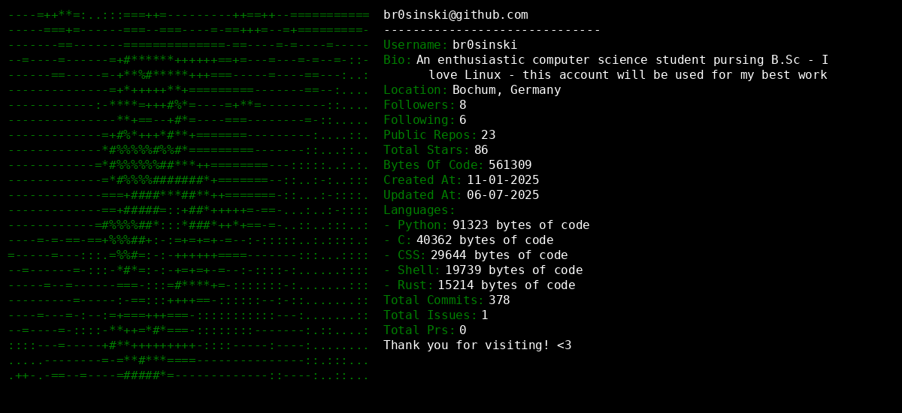

 

<h1 align="center"> 🍃 Thanks for checking out my profile! Follow me, I usually follow back =)! ⭐ </h1>

###

  
  

###

  
  
  
  
  
  
  
  
  
  
  
  
  
  
  
  
  
  
  
  
  

###

  

###

## Example Output

  

